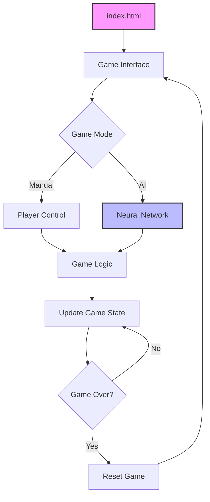
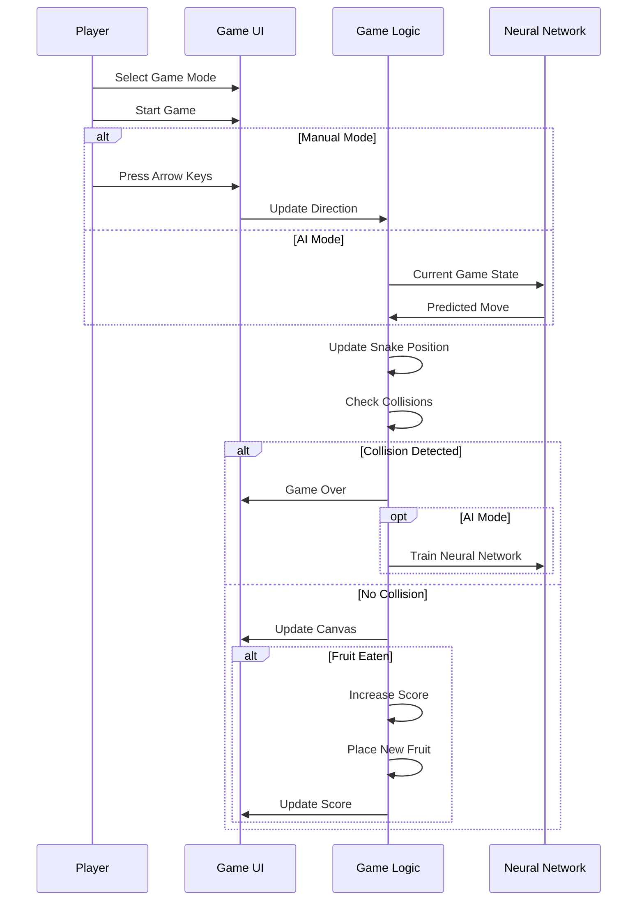
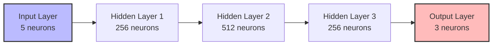

# 🎮 AI Snake Game with TensorFlow.js & Docker

An interactive Snake game that leverages TensorFlow.js for AI-powered gameplay. Players can choose between playing manually or allowing an AI model to control the snake.

## 📋 Table of Contents

- [Overview](#overview)
- [Features](#features)
- [Game Architecture](#game-architecture)
- [How It Works](#how-it-works)
- [File Structure](#file-structure)
- [Setup Instructions](#setup-instructions)
- [AI Implementation](#ai-implementation)
- [Contributing](#contributing)
- [License](#license)

## 🔍 Overview

This project demonstrates how machine learning can be applied to classic games. The Snake game is built with HTML5 Canvas and JavaScript, while TensorFlow.js powers the AI model that learns to play the game through a neural network.


## ✨ Features

- **Dual Game Modes**: Play manually using arrow keys or watch the AI play
- **Neural Network Learning**: The AI improves over time through reinforcement learning
- **Score Tracking**: Keep track of current score, high score, and generation count
- **Responsive Design**: Play on various screen sizes
- **Containerized**: Easily deploy using Docker

## 🏗️ Game Architecture



## 🧠 How It Works

### Game Mechanics



### Neural Network

The AI uses a sequential neural network with several dense layers:



## 📁 File Structure

| File | Description |
|------|-------------|
| **index.html** | Main HTML file containing the game interface and loading necessary scripts |
| **ai.js** | Contains the TensorFlow.js neural network model for AI gameplay |
| **script.js** | Main game logic, controls, collision detection, and rendering |
| **style.css** | CSS styling for the game interface |
| **Dockerfile** | Configuration for Docker container setup |
| **docker-compose.yml** | Docker Compose configuration for easy deployment |
| **mermaid.min.js** | Library for generating Mermaid diagrams (new addition) |

## 🚀 Setup Instructions

### Option 1: Using Docker

1. Clone the repository
   ```bash
   git clone https://github.com/ajeetraina/snake-game-using-ai.git
   ```

2. Navigate to the project directory
   ```bash
   cd snake-game-using-ai
   ```

3. Start with Docker Compose
   ```bash
   docker compose up -d
   ```

4. Access the game at http://localhost:8080

### Option 2: Without Docker

1. Clone the repository
   ```bash
   git clone https://github.com/ajeetraina/snake-game-using-ai.git
   ```

2. Navigate to the project directory
   ```bash
   cd snake-game-using-ai
   ```

3. Open index.html in your browser
   ```bash
   open index.html
   ```

## 🤖 AI Implementation

The AI uses a neural network implemented with TensorFlow.js:

1. **Input Layer**: 5 neurons representing:
   - 3 obstacle sensors (detecting walls or snake body in front, left, and right)
   - 2 fruit position indicators (relative x and y coordinates)

2. **Hidden Layers**: Several dense layers for pattern recognition:
   - Layer 1: 256 neurons
   - Layer 2: 512 neurons
   - Layer 3: 256 neurons

3. **Output Layer**: 3 neurons representing possible moves:
   - Left
   - Forward
   - Right

The AI learns through a form of reinforcement learning, where:
- Successful moves (getting closer to fruit, avoiding obstacles) are rewarded
- Failed moves (collisions, moving away from fruit) are penalized
- The model is trained after each game to improve performance

## 📝 File Details

### index.html
The main HTML file containing the game interface, canvas element, and script references. It loads the TensorFlow.js library and all game-related scripts.

### ai.js
Contains the neural network implementation using TensorFlow.js. This file defines the model architecture, training function, and prediction logic for the AI.

### script.js
The core game logic file handling:
- Game initialization and setup
- Game loop for both manual and AI modes
- Snake movement and control
- Collision detection
- Scoring and game state management
- Canvas rendering

### style.css
Handles all styling for the game interface, including the game board, controls, and scoreboard.

### Dockerfile & docker-compose.yml
Configuration files for containerizing the application using Docker and Nginx as a web server.

## 🤝 Contributing

Contributions are welcome! Please feel free to submit a Pull Request.

## 📄 License

This project is licensed under the Apache 2.0 License.
